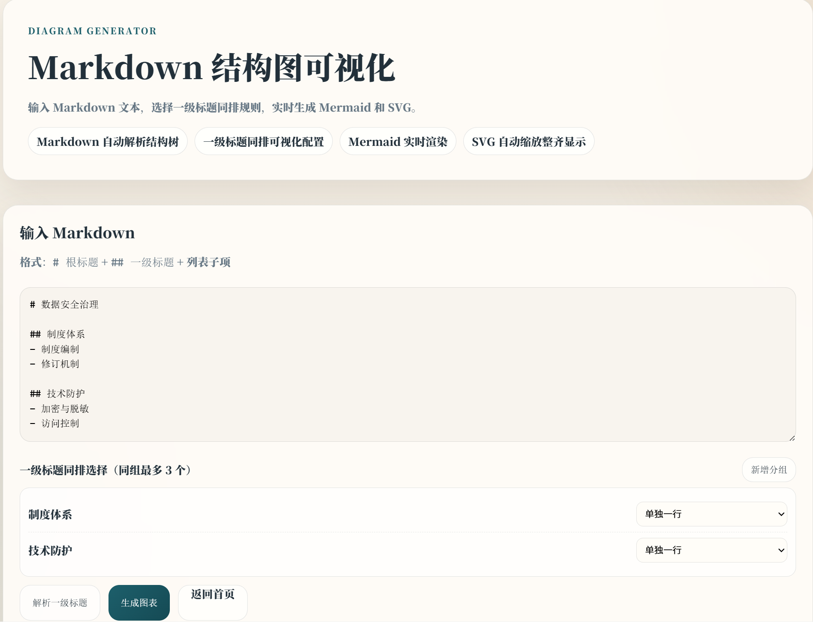
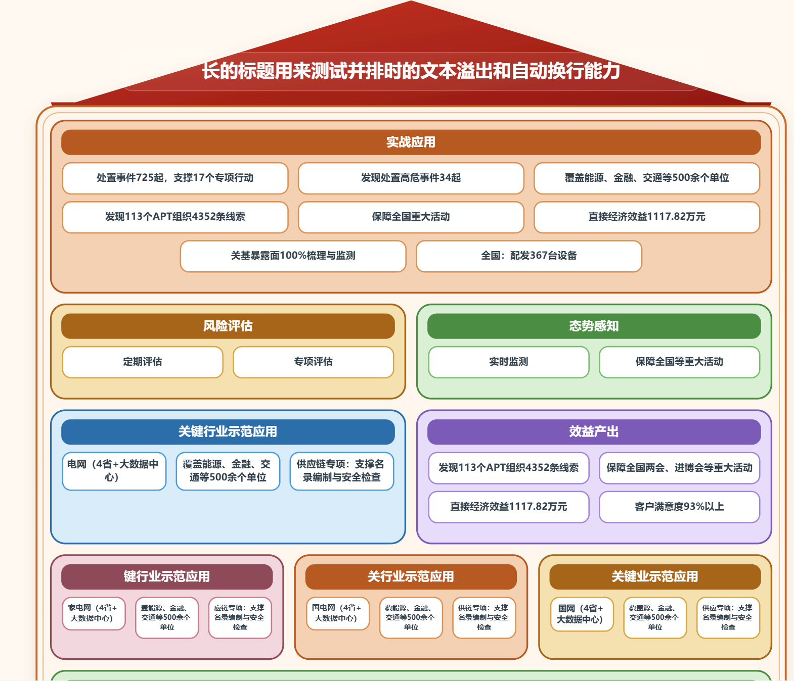

# Markdown 结构图生成工具

一个基于 `FastAPI + Jinja2` 的本地可视化项目。  
输入 Markdown 结构文本，前端可配置一级标题同排分组，生成：

- Mermaid 图
- SVG 结构图（海报风排版）

## 功能范围（当前）

### 图表页面

- 路径：`/diagram-generator`
- 输入：Markdown 文本
- 解析：
  - `#` 根标题
  - `##` 一级标题
  - `###` / 列表项 / 普通行 作为该一级标题下的子项
- 一级标题同排分组：
  - 可动态新增分组
  - 每组最多 3 个一级标题
  - 超限时弹框报错，并在处理结果框显示 `✅/❌`

### 图表生成 API

- `POST /api/diagram/generate`
- 请求字段：
  - `diagram_outline_text`（字符串，内容为 JSON）
- 返回字段：
  - `outline`
  - `diagram_mermaid`
  - `diagram_layered_svg`

兼容 `title` / `name`：若节点没有 `title` 但有 `name`，会自动映射。

## 安装与运行

```powershell
cd D:\project
python -m venv .venv
.venv\Scripts\activate
pip install -r requirements.txt
uvicorn app.main:app --reload
```

访问：

- 首页：`http://127.0.0.1:8000/`
- 图表页：`http://127.0.0.1:8000/diagram-generator`

## Markdown 输入示例

```md
# 数据安全治理

## 制度体系
- 制度编制
- 修订机制

## 技术防护
1. 加密与脱敏
2. 访问控制
```

## 页面示例截图

> 建议把截图放在仓库的 `docs/images/` 目录下。

### 前端页面示例



### 运行结果页面示例



## 常用环境变量

参考 `.env.example`：

```env
APP_HOST=127.0.0.1
APP_PORT=8000
```

## 测试

```powershell
pytest
```

## 当前目录结构

```text
app/
  api/
    diagram.py
  services/
    diagram_service.py
    outline_service.py
  static/
    css/style.css
    js/diagram_generator.js
  templates/
    diagram_generator.html
  main.py
tests/
requirements.txt
README.md
```
